# Projeto-Canil da Talita 🐶
&nbsp;

- Este é um projeto que utiliza Node.js e npm para gerenciar dependências.
&nbsp;

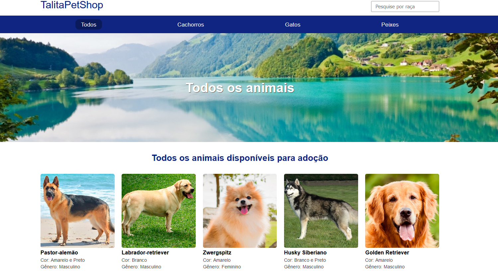

&nbsp;
&nbsp;

## Instruções de Configuração
&nbsp;
&nbsp;

Para iniciar este projeto, primeiro execute o seguinte comando para inicializar um novo projeto Node.js:
&nbsp;
&nbsp;

```bash
npm init
```

&nbsp;
&nbsp;

## Para instalar o TypeScript globalmente no seu sistema, execute o seguinte comando:


```bash
npm install -g typescript
```
- Isso permitirá que você use o comando tsc em qualquer lugar do seu sistema.    
&nbsp;

- Para verificar se o TypeScript foi instalado corretamente, você pode executar:   
```bash
tsc -v
``` 
- Instalação Local (Opcional)
<p>Se você preferir não instalar o TypeScript globalmente, você pode instalá-lo como uma dependência do projeto. Para isso, execute um dos seguintes comandos: </p>

```bash
npm install typescript
```
&nbsp;

### Inicializando o Projeto TypeScript
<p>Depois de instalar o TypeScript, você pode inicializar um novo projeto TypeScript executando o seguinte comando: </p>

```bash
npx tsc --init
```
### A seguir deve ser criada este arquivo depois instalar o TypeScript
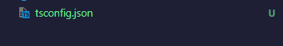
&nbsp;

### A seguir comando  é utilizado para instalar três pacotes diferentes no seu projeto Node.js.
- Express para criar seu servidor web.
- Mustache-express para renderizar templates HTML.
- Dotenv para gerenciar variáveis de ambiente de forma segura.    

```bash
npm install express mustache-express dotenv 
```
&nbsp;

### A seguir O comando
```bash
npm install --save-dev @types/express @types/mustache-express @types/node
```
- npm install: Este é o comando básico do npm para instalar pacotes. 

<p>@types/express: Pacote com definições de tipos TypeScript para o framework Express, permitindo uso com verificação de tipos e autocompletar.  </p>

<p>@types/mustache-express: Pacote com definições de tipos TypeScript para o adaptador Mustache-Express, oferecendo suporte a tipos em projetos TypeScript.</p>

<p>@types/node: Pacote com definições de tipos TypeScript para o ambiente Node.js, permitindo interação segura com as APIs nativas do Node.js.    </p>

&nbsp;

### Depois de fazer essas instalções e crie uma pasta " SRC " e dentro dela crie um arquivo chamado "server.ts" para começar a RODAR


- Agora para terminar com as configurações gerais do projeto vamos criar um atalho usando o nodemon
- 3 dependencias que devem estar globais são as seguintes prestar atenção!!
- NODEMON
- typescript
- ts-node
<p><strong>Essas dependencias devem estar globais</strong></p>

<p style="color: red;">Caso você não tenha essas dependências instaladas, não seja por isso, instale agora mesmo!</p>

```bash
npm install -g nodemon typescript ts-node
```

#

### Depois de feito tudo isso !!
- Vá ate seu 
<p style="color: green;"><a href="package.json">package.json</a></p>

- Adicionar essa seguinte informação !

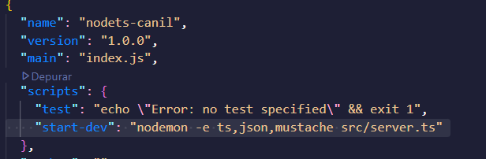

```bash
nodemon -e ts,json,mustache src/server.ts
```

#

### Pré-requisitos globais:

`npm install -g nodemon typescript ts-node`

#

### Instalação

`npm install`

#

### Para Rodar o Projeto

`npm run start-dev`

#

## Criando Rotas ✅🛤️🏳️

<p>Dentro da pasta routes que criei tenho um arquivo chamado <strong>index.ts</strong></p>

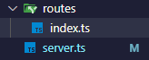
<a href="src/routes/index.ts">index.ts</a>

#
<p>COMUNICADO!!, essa pasta `_html`  não e obrigatoria no projeto, o arquivo HTML|pode ficar na raiz do projeto.</p>

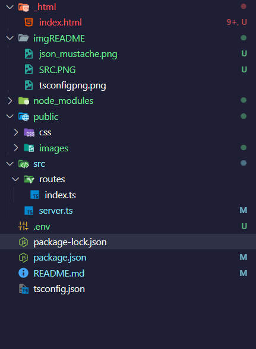

#

## ⚙️Estrutura do projeto daqui pra frente!😉
 
- Depois de eu ter configurado o servidor e ele já esta rodando eu criei 2 pastas dentro do `src`

<p>vou mostrar abaixo a estrutura dele</p>


#

## configurando as rotas para navegação controllers!!⛵


- filtram e mostram uma lista de imagem 
- vou fazer um controller para essas navegações!

&nbsp;
<p>Entre na pasta controllers para ver a estrutura e como configurei😉</p>
<a href="src/controllers/pageController.ts">controllers</a>

#

## separdo as views 
- dentro de `src` crie uma pasta views
- dentro dela crie as pasta `pages` e `partials`
<a href="src/views/">Link arquivo / Pasta views</a>

---
## Manipulando dados da navegação entre páginas

## Ativando menu ⚙️🗃️⬇️
<p>Aqui vou explicar como foi estruturado essa parte do código passo a passo!</p>
<p>Essa parte e básicamente, página inicial de um site que mostra animais (tipo cachorros, gatos e peixes).</p>

## Agora Vamos por Partes !!🍕 📦 1. Importações

``` ts
import { Request, Response } from 'express';
```
- `Request` é o pedido do cliente (tipo: "Oi, quero ver todos os animais!")

- `Response` é o que você vai entregar de volta (a página bonitinha com os animais).

## 🏠 2. Criando a função da rota home

``` ts
export const home = (req: Request, res: Response) => {
```
<p>🍳 Aqui estamos criando uma função chamada <strong>home</strong>.</p>

<p>Pensa que ela é o chefe da cozinha que vai preparar a página quando alguém quiser ver a página principal.</p>

## 🖼️ 3. Renderizando a página

``` ts
res.render('pages/page', {
```
<p>👩‍🍳 Esse é o momento em que o chefe fala:</p>

- "Vamos montar uma página usando o molde chamado `'pages/page'`."

## 🍔 4. Passando os dados (variáveis) para a view

``` ts
    menu: {
        all: true,
        dog: false,
        cat: false,
        fish: false
    },
```
<p>📋 Aqui ele está dizendo:</p>

- "No menu, vamos deixar 'Todos os animais' ligado `(true)` e os outros desligados `(false)`."
- É como se o site tivesse botões de filtro, e só o botão "Todos os animais" estivesse acesso `(tipo uma luzinha)`

## Banner 
``` ts
    banner: {
        title: 'Todos os animais',
        background: 'allanimals.jpg',
    }
```
<p>Outro objeto chamado banner está sendo enviado com:</p>

- `title:` o título do banner que vai aparecer na parte de cima da página.
- `background:` o nome da imagem de fundo que será mostrada.
- E fiz assim para os demais titulos e imagens !!.

<a href="src/controllers/pageController.ts">link da página / pageController</a>

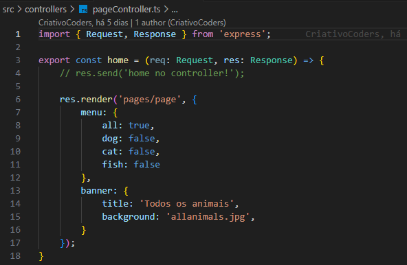

#

## Criando funções Auxiliares ⛱️💡

<p>Criei dentro da pasta src, outra pasta chamada helpers, e dentro dela criei o arquivo createMenuObjects.js</p>
<a href="src/helpers/createMenuObjects.ts">link pasta / helpers</a>


## Criando o Model pet:
- Clareza, Organização, Funcionalidade ✅
<h3>🐾 O que é isso?</h3>
<p>Esse código é um modelo de dados (model) chamado Pet, que serve para organizar, armazenar e buscar informações sobre animais (cachorros, gatos e peixes) em meu web site</p>


<h2>✅ Pra que serve exatamente?</h2>

<h3> 1. Amazenar dados dos pets</h3>
<p>Você cria uma lista (data) com vários pets, cada um com:</p>

- tipo (dog, cat, fish)
- nome
- imagem 
- cor
- sexo

<br>

<h3>2. Buscar todos os pets</h3>


- A função `getAll()` devolve a lista inteira de animais, útil para a página inicial do site, por exemplo.

<br>

<h3>3. Filtrar pets por tipo</h3>

- A função `getFromType('dog')` devolve apenas os cachorros. Isso é útil se alguém clicar em um botão.
`"Ver somente cães"`
<br>

<h3>4. Filtrar pets por nome</h3>

- A função `getFromName('bul')` devolve todos os pets que tenham `“bul”` no nome, como `“Bulldog”`. Isso é um sistema de busca inteligente, que funciona mesmo com partes do nome e sem diferenciar maiúsculas de minúsculas.

<br>

<a href="src/models/pets.ts">link para / pasta models</a>

#

<h1>Listando os pets no controller 😉</h1>

<h3>Usando o model dentro do controller</h3>
<br>

- Primeiro fiz a importação dos controllers aqui 

<a href="src/controllers/pageController.ts">link / pasta controlles / pageControllers</a>

- dentro da pasta views/pages/page -  eu chamo as depedencias que coloquei no meu models !

<a href="src/views/pages/page.mustache">link / pasta views/ pages/ page.mustache</a>

#

<h2>Aqui estou fazendo rotas com essas seguintes estruturas ⛵⛵</h2>

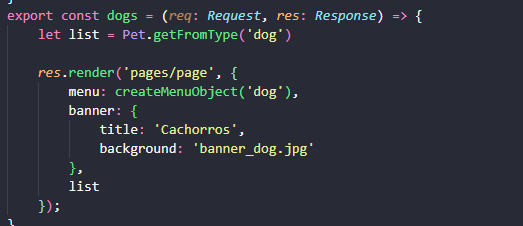

``` ts
let list = Pet.getFromType('dog')
```

- repare que eu chamo a lista do meu models que criei para chamar essas rotas !!

# 

# Fazendo Busca e o 404 tratamento de Erros

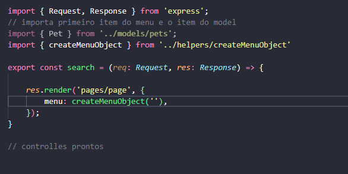

<a href="src/controllers/searchController.ts">Link / Pasta controllers / arquivo searchControllers</a>

#

<h2>Informação importante ❌❌❌</h2>

- Perceba que fiz uma pesquisa chamada buldog, apareceu a seguinte informação `http://localhost:4001/search?q=buldog`
- perceba que apareceu um `q` perceba que terei que pagar um request para fazer esse cara.

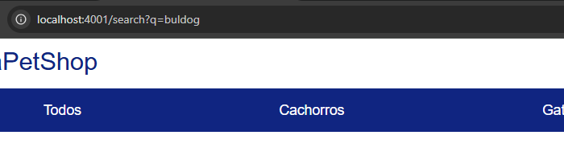

- olhe abaixo o codigo e como fiz funcionar e basicamente aqui que a magica da pesquisa funciona !! se digitar maiusculo ou minusculo ele vai encontrar mesmo assim .

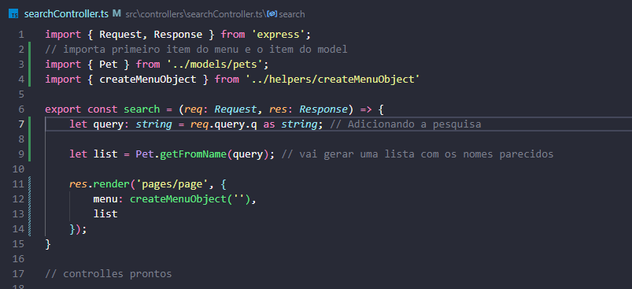

#

# Criando Script para manter nome da pesquisa na Barra de Pesquisa.

- primeiro passo ir no arquivo searchController.ts, pegar o query mandar para página
- depois ir no herader.mustache, é no input e colocar um ``value="{{ query }}"`

``` html

<form method="GET" action="/search">
    <input type="search" name="q" placeholder="Pesquise por raça" value="{{ query }} /> 
</form>

```

# COLOCANDO PROJETO NO AR ✈️✈️✈️

- Como criamos o projeto em typeScript, para coloca-lo no ar, precisamos converter e transcrever os arquivos para javaScript para que ele funcione no Node.

- Usando Heroku, que quando jogarmos o projeto na plataforma dele, que ele vai jogar atráves do git ja tendo o repositorio para pegar os dados do projeto !!

# 

### 1 - Criei um arquivo chamado Procfile para implantar aplicações em plataformas de cloud como Heroku

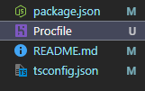

<br>
<p>O Procfile informa à plataforma qual comando deve ser executado para iniciar a sua aplicação. É uma forma simples de dizer, por exemplo:</p>

- Qual arquivo iniciar `(ex: node dist/server.js)`
- Qual comando rodar `(ex: npm start, npm run serve)`

<br>
<p>Em meu caso coloquei:</p>

- web: npm start

#

### 2 - No arquivo tsconfig.json verifique se voce tem:

-  `"outDir": "dist",`  

-  `"rootDir": "src",`

<p>Tendo Ambos coloque o seguinte comando no terminal</p>

- `tsc`

<p>vai gerar uma pasta chamada dist, isso significa que o TypeScript compilou os arquivos.ts, e gerou arquivos.js dentro da pasta "dist"</p>

- isso e importante pois o Node.js não entende TypeScript nativamente, então você precisa transpilar .ts para .js antes de executar.
- A pasta dist é onde ficam esses arquivos prontos para produção.

#

### 3 - seu arquivo de configuração package.jason deve conter esses comandos aqui támbem !!

``` json
{
  "name": "nodets-canil",
  "version": "1.0.0",
  "main": "index.js",
  
  "engines":{
    "node": "22.x"
  },
  "scripts": {
    "start": "node dist/server.js", 
    "postinstall": "",

    "test": "echo \"Error: no test specified\" && exit 1",
    "start-dev": "nodemon -e ts,json,mustache src/server.ts"
  },
  "author": "TalitaCristina",
  "license": "ISC",
  "description": "&nbsp;",
  "dependencies": {
    "dotenv": "^16.5.0",
    "express": "^5.1.0",
    "mustache-express": "^1.3.2"
  },
  "devDependencies": {
    "@types/express": "^5.0.3",
    "@types/mustache-express": "^1.2.5",
    "@types/node": "^22.16.0",
    "typescript": "^5.8.3"
  }
}

```
- engines
- start
- postinstall

#

### 4 - Faça um teste rodando o Projeto

- `node dist/server.js`

<h3>Atenção pois aparecerá um erro</h3>

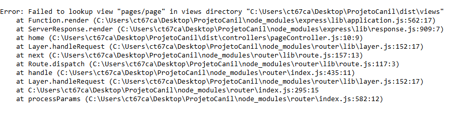

- Fala que ele não achou pages/page na pasta views e procurou "C:\Users\ct67ca\Desktop\ProjetoCanil\dist\views"
<br>

<h3>Resolvendo o problema</h3>
<p>oque aconteceu ???</p>

- dentro da pasta dist não tem a pasta dist, porque nessa pasta não tem typescript e foi ignorada.

<br>

- encerre o terminal
- e rodar o comando typeScript
- e rodar  outro comando para copiar os items da pasta views todos os mustaches para a pasta dist.

<br>

<p>Delete a pasta dist</p>

- vamos instalar uma biblioteca que ajuda a fazer transcrições e copias
- `npm install --save-dav copyfiles``

<br>
<p>Colocar esse comando no "postinstall": apos instalar a biblioteca </p>

- "postinstall": "tsc && copyfiles -u 1 src/**/*.mustache dist/",


``` json
  "scripts": {
    "start": "node dist/server.js",
    "postinstall": "tsc && copyfiles -u 1 src/**/*.mustache dist/",
    "test": "echo \"Error: no test specified\" && exit 1",
    "start-dev": "nodemon -e ts,json,mustache src/server.ts"
  },
```

#

### 5 - Rodando 

<p>Depois dar o comando </p>

- npm run postinstall

<p>Ele vai gerar outra pasta dist </p>

- ``npm start` vai iniciar o servidor novamente.

#

### 6 - Configurando Heroku

1 
- crie uma conta no Heroku
- depois pesquise por heroku cli para instalar 

<br>

2
- Depois de instalar veirifique se foi instalado corretamente `heroku --version`
- feito isso no terminal da um `heroku login`no cmd e fazer o login

<br>

3
- depois ir até a pasta do projeto `cd nome do projeto`
- depois que entrar na pasta da um `heroku create` ele vai gerar uma url e tudo mais
- depois dar um `git add .`
- git commit -m "heroku setup"
- git push heroku main, esperar ele termina o processo de configuração

<br>

#

<h3>Atenção nosso tsc vai da um problema pois esta em um comando global</h3>
<p>Vamos resolver o problema:</p>

- vamos dar o comando `npm install typescript` e instalar dentro do projeto
- depois de instalado e vamos criar um script chamado tsc..

``` json
  "scripts": {
    "tsc": "tsc",
    "start": "node dist/server.js",
    "postinstall": "npm run tsc && copyfiles -u 1 src/**/*.mustache dist/",
    "test": "echo \"Error: no test specified\" && exit 1",
    "start-dev": "nodemon -e ts,json,mustache src/server.ts"
  },
```

- `"postinstall": "npm run tsc && copyfiles -u 1 src/**/*.mustache dist/",` coloquei npm run tsc nesta linha para rodar

#

4 
- depois da um git commit -m "qualquer coisa - add tsc"
- e dar o git push novamente `git push heroku main`
- depois de finalizado
- depois da o comando `heroku open` no cmd e vai gerar um link com o projeto funcionando