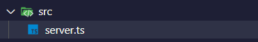

# Projeto-Canil da Talita 🐶
 

- Este é um projeto que utiliza Node.js e npm para gerenciar dependências.
 


 
 

## Instruções de Configuração
 
 

Para iniciar este projeto, primeiro execute o seguinte comando para inicializar um novo projeto Node.js:
 
 

```bash
npm init
```

 
 

## Para instalar o TypeScript globalmente no seu sistema, execute o seguinte comando:


```bash
npm install -g typescript
```
- Isso permitirá que você use o comando tsc em qualquer lugar do seu sistema.    
 

- Para verificar se o TypeScript foi instalado corretamente, você pode executar:   
```bash
tsc -v
``` 
- Instalação Local (Opcional)
<p>Se você preferir não instalar o TypeScript globalmente, você pode instalá-lo como uma dependência do projeto. Para isso, execute um dos seguintes comandos: </p>

```bash
npm install typescript
```
&nbsp;

### Inicializando o Projeto TypeScript
<p>Depois de instalar o TypeScript, você pode inicializar um novo projeto TypeScript executando o seguinte comando: </p>

```bash
npx tsc --init
```
### A seguir deve ser criada este arquivo depois instalar o TypeScript

&nbsp;

### A seguir comando  é utilizado para instalar três pacotes diferentes no seu projeto Node.js.
- Express para criar seu servidor web.
- Mustache-express para renderizar templates HTML.
- Dotenv para gerenciar variáveis de ambiente de forma segura.    

```bash
npm install express mustache-express dotenv 
```
&nbsp;

### A seguir O comando
```bash
npm install --save-dev @types/express @types/mustache-express @types/node
```
- npm install: Este é o comando básico do npm para instalar pacotes. 

<p>@types/express: Pacote com definições de tipos TypeScript para o framework Express, permitindo uso com verificação de tipos e autocompletar.  </p>

<p>@types/mustache-express: Pacote com definições de tipos TypeScript para o adaptador Mustache-Express, oferecendo suporte a tipos em projetos TypeScript.</p>

<p>@types/node: Pacote com definições de tipos TypeScript para o ambiente Node.js, permitindo interação segura com as APIs nativas do Node.js.    </p>

&nbsp;

### Depois de fazer essas instalções e crie uma pasta " SRC " e dentro dela crie um arquivo chamado "server.ts" para começar a RODAR


- Agora para terminar com as configurações gerais do projeto vamos criar um atalho usando o nodemon
- 3 dependencias que devem estar globais são as seguintes prestar atenção!!
- NODEMON
- typescript
- ts-node
<p><strong>Essas dependencias devem estar globais</strong></p>

<p style="color: red;">Caso você não tenha essas dependências instaladas, não seja por isso, instale agora mesmo!</p>

```bash
npm install -g nodemon typescript ts-node
```

#

### Depois de feito tudo isso !!
- Vá ate seu 
<p style="color: green;"><a href="package.json">package.json</a></p>

- Adicionar essa seguinte informação !


```bash
nodemon -e ts,json,mustache src/server.ts
```

#

### Pré-requisitos globais:

`npm install -g nodemon typescript ts-node`

#

### Instalação

`npm install`

#

### Para Rodar o Projeto

`npm run start-dev`

#

## Criando Rotas ✅🛤️🏳️

<p>Dentro da pasta routes que criei tenho um arquivo chamado <strong>index.ts</strong></p>


<a href="src/routes/index.ts">index.ts</a>

#
<p>COMUNICADO!!, essa pasta `_html`  não e obrigatoria no projeto, o arquivo HTML|pode ficar na raiz do projeto.</p>


#

## ⚙️Estrutura do projeto daqui pra frente!😉
 
- Depois de eu ter configurado o servidor e ele já esta rodando eu criei 2 pastas dentro do `src`

<p>vou mostrar abaixo a estrutura dele</p>
